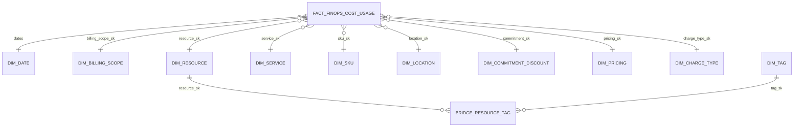

# Modèle de données analytique FinOps

## Principe

Le modèle cloud reprend le schéma en étoile validé dans le POC. La table
Silver centrale conserve la représentation FOCUS complète pour l'exploration
et les contrôles, tandis que Gold expose un modèle stable pour la BI.

Le code SQL exécutable se trouve dans :

- `sql/gold` pour les DDL et chargements Gold
- `sql/datamarts` pour les 14 produits analytiques

Ces fichiers sont la source de vérité du projet et sont embarqués comme données
dans la wheel Python. PySpark les appelle dans l'ordre, mais ne redéfinit pas
leur logique métier.

## Grain

`fact_finops_cost_usage` contient une ligne par ligne de coût ou d'usage FOCUS
reçue dans un fichier source. `cost_usage_sk` est une clé technique SHA-256
déterministe construite à partir du fichier source et de la position logique de
la ligne. `billing_month` est conservé dans la fact pour permettre le
remplacement transactionnel d'un mois Delta.

Le billing mensuel est l'autorité finale. Il remplace la partition logique du
même mois précédemment alimentée par les fichiers daily. Les deux sources ne
sont jamais additionnées.

## Relations principales

## Tables Gold

| Table | Rôle | Clé |
|---|---|---|
| `dim_date` | Calendrier commun aux sept dates de la fact | `date_sk` au format `yyyyMMdd` |
| `dim_billing_scope` | Compte, sous-compte, profil, client et centre de coût | `billing_scope_sk` |
| `dim_resource` | Ressource, groupe et attributs applicatifs issus des tags | `resource_sk` |
| `dim_service` | Service, fournisseur, éditeur et revendeur | `service_sk` |
| `dim_sku` | SKU, meter, offre, ordre, région et terme | `sku_sk` |
| `dim_location` | Région et zone de disponibilité | `location_sk` |
| `dim_commitment_discount` | Réservation, Savings Plan ou autre engagement | `commitment_sk` |
| `dim_pricing` | Catégorie, unité et devise de prix | `pricing_sk` |
| `dim_charge_type` | Catégorie et fréquence de charge | `charge_type_sk` |
| `dim_tag` | Couple clé/valeur de tag normalisé | `tag_sk` |
| `bridge_resource_tag` | Relation plusieurs-à-plusieurs ressource/tag | clé composée ressource/tag |
| `fact_finops_cost_usage` | Mesures de coûts, prix, quantités et clés étrangères | `cost_usage_sk` |

Les clés de dimensions sont des chaînes SHA-256. Ce choix est déterministe,
portable et évite de dépendre d'une séquence propre à un environnement.

`dim_billing_scope` et `dim_resource` appliquent une gestion Type 1 : les
attributs courants sont mis à jour par `MERGE`. Les colonnes de validité sont
conservées pour la compatibilité du modèle et une future évolution SCD2, mais
la version actuelle ne prétend pas historiser chaque changement d'attribut.

Le jeu de données actuel ne fournit ni `AvailabilityZone` ni identifiant de
charge natif. `availability_zone` prend donc la valeur `Unknown` et les
identifiants de charge sont générés de manière déterministe. Si ces champs sont
ajoutés à une future version du Data Contract, une migration SQL explicite sera
réalisée.

## Datamarts certifiés

| Datamart | Usage principal |
|---|---|
| `dm_monthly_billing` | Coût facturé mensuel |
| `dm_daily_billing` | Tendance quotidienne |
| `dm_cost_by_scope_service_month` | Coût par périmètre et service |
| `dm_top_services` | Services les plus coûteux |
| `dm_top_resources` | Ressources les plus coûteuses |
| `dm_cost_by_charge_type` | Analyse des catégories de charge |
| `dm_sku_cost` | Analyse SKU et meter |
| `dm_savings_monthly` | Économies négociées et engagements |
| `dm_executive_summary_monthly` | KPI de synthèse mensuelle |
| `dm_top_resources_monthly` | Ressources par mois |
| `dm_data_quality_monthly` | Indicateurs de qualité Silver |
| `dm_cost_by_resource_group_month` | Coût par groupe de ressources |
| `dm_cost_by_subscription_month` | Coût par sous-compte/abonnement |
| `dm_cost_by_application_owner_month` | Coût et responsabilité applicative |

Les datamarts 8, 9 et 11 utilisent directement la table Silver centrale car
ils exploitent des champs FOCUS et des métadonnées techniques qui ne font pas
tous partie de la fact. Les autres datamarts utilisent le modèle Gold.

## Ordre d'exécution

1. `00_create_gold_tables.sql` crée les structures si elles sont absentes.
2. `10_merge_dimensions.sql` alimente les dimensions.
3. `20_merge_tags.sql` normalise les tags et alimente la table de pont.
4. `30_replace_fact_month.sql` remplace le mois dans la fact.
5. Les scripts `01` à `14` recréent les datamarts depuis les tables certifiées.

La première version privilégie un recalcul complet des datamarts pour garantir
un résultat simple et reproductible. Une optimisation par mois pourra être
introduite après mesure du volume et du temps d'exécution dans Databricks DEV.
