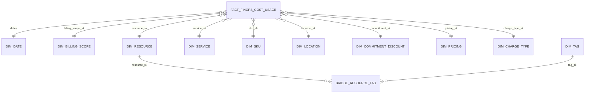

# FinOps analytical data model

## Principle

The cloud model preserves the star schema validated in the POC. The central
Silver table retains the complete FOCUS representation for exploration and
controls, while Gold exposes a stable BI model.

Executable SQL is organized by purpose:

- `sql/gold/table_creation` for Gold DDL;
- `sql/gold/data_loading` for Gold loads;
- `sql/datamarts/table_refresh` for the fourteen analytical products.

These files are the project's source of truth and are embedded as data in the
Python wheel. PySpark invokes them in order without redefining business logic.

## Grain

`fact_finops_cost_usage` contains one row per FOCUS cost or usage line received
in a source file. `cost_usage_sk` is a deterministic SHA-256 technical key
derived from the source file and logical row position. `billing_month` remains
in the fact table to support transactional replacement of one Delta month.

Monthly billing is authoritative. It replaces the logical partition previously
fed by daily files for the same month. The two sources are never added together.

Bronze preserves source values exactly. Before the blocking Silver validation,
the Data Contract applies one explicit remediation: an Adjustment row whose
`ServiceName` is null receives its non-empty `ChargeDescription`. The known
rounding rows therefore use `RoundingAdjustment`. Every other missing
`ServiceName` remains invalid; generic `Unknown`, `ResourceName`, and
`ResourceType` fallbacks are not used.

## Main relationships

## Gold tables

| Table | Purpose | Key |
|---|---|---|
| `dim_date` | Shared calendar for the fact table's seven dates | `date_sk` as `yyyyMMdd` |
| `dim_billing_scope` | Account, subaccount, profile, customer, and cost center | `billing_scope_sk` |
| `dim_resource` | Resource, group, and application attributes derived from tags | `resource_sk` |
| `dim_service` | Service, provider, publisher, and reseller | `service_sk` |
| `dim_sku` | SKU, meter, offer, order, region, and term | `sku_sk` |
| `dim_location` | Region and availability zone | `location_sk` |
| `dim_commitment_discount` | Reservation, Savings Plan, or other commitment | `commitment_sk` |
| `dim_pricing` | Pricing category, unit, and currency | `pricing_sk` |
| `dim_charge_type` | Charge category and frequency | `charge_type_sk` |
| `dim_tag` | Normalized tag key/value pair | `tag_sk` |
| `bridge_resource_tag` | Many-to-many resource/tag relationship | resource/tag composite key |
| `fact_finops_cost_usage` | Costs, prices, quantities, and foreign keys | `cost_usage_sk` |

Dimension keys are deterministic SHA-256 strings. This portable design avoids
environment-specific sequences.

`dim_billing_scope` and `dim_resource` currently use Type 1 handling: `MERGE`
updates current attributes. Validity columns remain for model compatibility and
a future SCD2 evolution, but this version does not claim to preserve every
attribute change.

The current dataset provides neither `AvailabilityZone` nor a native charge
identifier. `availability_zone` therefore uses `Unknown`, and charge IDs are
generated deterministically. A future Data Contract version that adds these
fields will require an explicit SQL migration.

## Certified datamarts

| Datamart | Main use |
|---|---|
| `dm_monthly_billing` | Monthly billed cost |
| `dm_daily_billing` | Daily trend |
| `dm_cost_by_scope_service_month` | Cost by scope and service |
| `dm_top_services` | Most expensive services |
| `dm_top_resources` | Most expensive resources |
| `dm_cost_by_charge_type` | Charge-category analysis |
| `dm_sku_cost` | SKU and meter analysis |
| `dm_savings_monthly` | Negotiated and commitment savings |
| `dm_executive_summary_monthly` | Monthly executive KPIs |
| `dm_top_resources_monthly` | Resources by month |
| `dm_data_quality_monthly` | Silver quality indicators |
| `dm_cost_by_resource_group_month` | Cost by resource group |
| `dm_cost_by_subscription_month` | Cost by subaccount/subscription |
| `dm_cost_by_application_owner_month` | Cost and application ownership |

Datamarts 8, 9, and 11 read the central Silver table directly because they use
FOCUS fields and technical metadata that are not all present in the fact table.
The other datamarts use the Gold model.

## Execution order

1. `00_create_gold_tables.sql` creates missing structures.
2. `10_merge_dimensions.sql` loads dimensions.
3. `20_merge_tags.sql` normalizes tags and loads the bridge table.
4. `30_replace_fact_month.sql` replaces the month in the fact table.
5. Scripts `01` through `14` recreate datamarts from certified tables.

The first version deliberately performs a full datamart refresh for simplicity
and reproducibility. Month-level optimization can follow measurements in
Databricks DEV.
