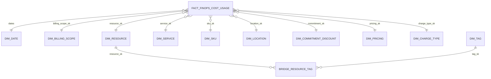

# FinOps analytical data model

## Principle

The cloud model preserves the star schema validated in the POC. The central
Silver table retains the complete FOCUS representation for exploration and
controls, while Gold exposes a stable BI model.

Executable SQL is organized by purpose:

- `platform/common/sql/gold/table_creation` for Gold DDL;
- `platform/common/sql/gold/data_loading` for Gold loads;
- `platform/common/sql/datamarts/table_refresh` for the fourteen analytical products.

These files are the project's source of truth and are embedded as data in the
Python wheel. PySpark invokes them in order without redefining business logic.

## Grain

`fact_finops_cost_usage` contains one row per FOCUS cost or usage line received
in a source file. `cost_usage_sk` is a SHA-256 technical key derived from the
source file and a logical row number ordered by selected business fields.
Distinct rows can tie on those fields: stable keys across replays are not
guaranteed for such ties. `billing_month` remains
in the fact table to support transactional replacement of one Delta month.

Monthly billing is authoritative. It replaces the logical partition previously
fed by daily files for the same month. The two sources are never added together.

Bronze preserves source values exactly. Before the blocking Silver validation,
the Data Contract applies one explicit remediation: an Adjustment row whose
`ServiceName` is null receives its non-empty `ChargeDescription`. The known
rounding rows therefore use `RoundingAdjustment`. Every other missing
`ServiceName` remains invalid; generic `Unknown`, `ResourceName`, and
`ResourceType` fallbacks are not used.

## Main relationships

```mermaid
erDiagram
    FACT_FINOPS_COST_USAGE }o--|| DIM_DATE : "dates"
    FACT_FINOPS_COST_USAGE }o--|| DIM_BILLING_SCOPE : billing_scope_sk
    FACT_FINOPS_COST_USAGE }o--|| DIM_RESOURCE : resource_sk
    FACT_FINOPS_COST_USAGE }o--|| DIM_SERVICE : service_sk
    FACT_FINOPS_COST_USAGE }o--|| DIM_SKU : sku_sk
    FACT_FINOPS_COST_USAGE }o--|| DIM_LOCATION : location_sk
    FACT_FINOPS_COST_USAGE }o--|| DIM_COMMITMENT_DISCOUNT : commitment_sk
    FACT_FINOPS_COST_USAGE }o--|| DIM_PRICING : pricing_sk
    FACT_FINOPS_COST_USAGE }o--|| DIM_CHARGE_TYPE : charge_type_sk
    DIM_RESOURCE ||--o{ BRIDGE_RESOURCE_TAG : resource_sk
    DIM_TAG ||--o{ BRIDGE_RESOURCE_TAG : tag_sk
```

## Gold tables

| Table | Purpose | Key |
|---|---|---|
| `dim_date` | Shared calendar for the fact table's seven dates | `date_sk` as `yyyyMMdd` |
| `dim_billing_scope` | Account, subaccount, profile, customer, and cost center | `billing_scope_sk` |
| `dim_resource` | Resource, group, and application attributes derived from tags | `resource_sk` |
| `dim_service` | Service, provider, publisher, and reseller | `service_sk` |
| `dim_sku` | SKU, meter, offer, order, region, and term | `sku_sk` |
| `dim_location` | Region and availability zone | `location_sk` |
| `dim_commitment_discount` | Reservation, Savings Plan, or other commitment | `commitment_sk` |
| `dim_pricing` | Pricing category, unit, and currency | `pricing_sk` |
| `dim_charge_type` | Charge category and frequency | `charge_type_sk` |
| `dim_tag` | Normalized tag key/value pair | `tag_sk` |
| `bridge_resource_tag` | Many-to-many resource/tag relationship | resource/tag composite key |
| `fact_finops_cost_usage` | Costs, prices, quantities, and foreign keys | `cost_usage_sk` |

Dimension keys are deterministic SHA-256 strings. This portable design avoids
environment-specific sequences.

`dim_charge_type` exposes only category and frequency. The source has no charge
subcategory, so the former constant attribute is removed. Dimension and fact
loaders keep the legacy hash token solely to preserve existing foreign keys;
it is not a business column. Existing tables require the guarded manual notebook
`platform/common/notebooks/operations/remove_charge_subcategory.ipynb`, described
in `platform/common/sql/gold/README.md`. No fact or upstream reload is required.

The Gold logical view `v_cost_allocation` preserves each central Silver charge
and its original `x_CostCenter` as `cost_center_source`. A usable source value
takes priority; otherwise the synthetic `REGION_FALLBACK_V1` policy allocates the
five approved European regions to `CostCenter_Europe`, Global and any explicitly
approved headquarters regions to `CostCenter_Corporate`, and remaining cases to
`Unallocated Costs`. The Corporate region allowlist is initially empty.
`cost_center_allocated`, `allocation_method` and `allocation_policy_version`
trace this enrichment. No Parquet, Bronze, Silver, fact or dimension value is
rewritten. Regional fallbacks are simulated business ownership, not facts inferred
from Azure hosting geography. Datamart 03 and the protected serving view use
the same line-level Gold view, never `dim_billing_scope.cost_center` for this policy.
This avoids the Type-1 dimension assigning one center to several charge regions.
See `platform/common/sql/gold/README.md` for manual DEV/PROD application.

`dim_billing_scope` and `dim_resource` currently use Type 1 handling: `MERGE`
updates current attributes. Validity columns remain for model compatibility and
a future SCD2 evolution, but this version does not claim to preserve every
attribute change.

The current dataset provides neither `AvailabilityZone` nor a native charge
identifier. `availability_zone` therefore uses `Unknown`, and charge IDs are
generated with the row-order limitation described above. A future Data Contract version that adds these
fields will require an explicit SQL migration.

## Analytical datamarts

| Datamart | Main use |
|---|---|
| `dm_monthly_billing` | Monthly billed cost |
| `dm_daily_billing` | Daily trend |
| `dm_cost_by_scope_service_month` | Line-level allocated Cost Center, customer and service |
| `dm_top_services` | Most expensive services |
| `dm_top_resources` | Most expensive resources |
| `dm_cost_by_charge_type` | Charge-category analysis |
| `dm_sku_cost` | SKU and meter analysis |
| `dm_savings_monthly` | Cost-base comparisons and effective-cost components |
| `dm_executive_summary_monthly` | Monthly executive KPIs |
| `dm_top_resources_monthly` | Resources by month |
| `dm_data_quality_monthly` | Silver quality indicators |
| `dm_cost_by_resource_group_month` | Cost by resource group |
| `dm_cost_by_subscription_month` | Cost by subaccount/subscription |
| `dm_cost_by_application_owner_month` | Cost and application ownership |

Datamarts 8, 9, and 11 read the central Silver table directly because they use
FOCUS fields and technical metadata that are not all present in the fact table.
Datamart 3 reads the Gold allocation view over central Silver. The remaining
datamarts use the physical Gold model.

The dashboard's Realized Savings label means `List Cost - Effective Cost`.
It is a price-base comparison, not proof of cash savings caused by an
optimization. Reservation and Savings Plan components sum source effective
costs on eligible Usage rows; they are not full upfront purchase amounts.

## Execution order

1. `00_create_gold_tables.sql` creates missing structures.
2. `10_merge_dimensions.sql` loads dimensions.
3. `20_merge_tags.sql` normalizes tags and loads the bridge table.
4. `30_replace_fact_month.sql` replaces the month in the fact table.
5. `01_create_cost_allocation_view.sql` publishes the shared allocation policy.
6. Scripts `01` through `14` recreate datamarts from certified tables/views.

The first version deliberately performs a full datamart refresh for simplicity
and reproducibility. Month-level optimization can follow measurements in
Databricks DEV.
